  

<h1 align="center">Hi, I'm Kevin Yepes 👋</h1>
<h3 align="center">Backend Developer · Process Automation · API Integration</h3>

  
  
  

## About me

Software Development Analyst and Backend Developer focused on building reliable APIs, business integrations and automation solutions.

I enjoy turning repetitive processes into maintainable systems that save time, reduce errors and create measurable operational impact.

- 💼 **Currently:** Junior Backend Developer at **Rootstack**
- ⚙️ **Focus:** Python, Django, REST APIs, integrations, automation and backend systems
- 📉 **Impact:** Reduced manual operational workload by up to **70%** through automation
- 🐳 **Infrastructure:** Docker, Linux, SSH, deployments, logs and troubleshooting
- 🌱 **Learning:** Microservices architecture, MongoDB and scalable backend design

## Tech stack

### Backend and automation

  
  
  
  
  
  
  
  

### Data, cloud and infrastructure

  
  
  
  
  
  
  

### Frontend, workflow and collaboration

  
  
  
  
  
  
  
  
  
  

### Business automation

  
  
  
  

## Technical capabilities

- **Backend development:** Python, Django, Django REST Framework, Flask, Celery, NestJS, Prisma ORM and object-oriented programming.
- **APIs and integrations:** REST API design and integration, HTTP methods, JSON, Swagger/OpenAPI documentation, Postman, Thunder Client, Requests and third-party service integrations.
- **Automation and web scraping:** Selenium, RPA, browser automation, data extraction, automated file processing and operational workflow automation.
- **Google Apps Script:** Google Sheets workflow automation, data processing, custom functions, triggers, automated reports, notifications and external API integrations.
- **Data and reporting:** Pandas, MySQL, query optimization, ETL-style processes, data cleaning, automated reports and MongoDB fundamentals.
- **Infrastructure:** Docker, Linux, SSH, virtual machines, deployments, logs, permissions, filesystem management and service troubleshooting.
- **Frontend:** HTML5, JavaScript, React, Next.js, Tailwind CSS, Bootstrap and Atomic Design principles.
- **Low-code and business solutions:** Zoho Creator, Deluge, custom business workflows and API-connected applications.
- **Development workflow:** Git, GitHub, GitLab, Bitbucket, Jira, branching, pull requests, code reviews and agile collaboration.
- **Cloud and tools:** Amazon Web Services, Microsoft Azure, Google Search Console, Tkinter and Windows Console.

**Professional strengths:** Responsibility and commitment · Continuous learning · Logical and analytical thinking · Teamwork and collaboration · Quality-oriented mindset

**Languages:** Spanish · English

## Experience

### Rootstack — Junior Backend Developer

`2026 – Present`

- Develop and maintain backend features with Python, Django and REST APIs.
- Work with asynchronous processes, integrations, Docker-based environments and cloud services.
- Collaborate through Jira, GitHub and Bitbucket in agile development workflows.
- Contribute to frontend integrations using React, Next.js and Tailwind CSS when required.

### ValleSalud — Software Development Analyst

`May 2023 – April 2026`

- Built Python and Selenium bots for healthcare and administrative platforms.
- Automated data processing, reporting and repetitive operational workflows.
- Built Google Apps Script solutions for spreadsheet workflows, triggers, reports and service integrations.
- Developed REST API integrations and Zoho Creator solutions using Deluge.
- Managed Docker environments, Linux services and MySQL integrations.
- Reduced manual operational workload by up to **70%** through automation.

## Featured projects

- **Bot-Citas:** Selenium automation for appointment scheduling platforms.
- **SIRAS Automation:** Downloading, organizing and processing medical documents with Python and Selenium.
- **Kava Project:** Monitoring and data visualization platform built with Flask and JavaScript.
- **Google Workspace Automation:** Apps Script solutions for Sheets workflows, reporting, triggers and API integrations.
- **Zoho Creator Solutions:** Business workflows, Deluge scripts and API integrations.
- **RPA Egresos:** Desktop automation for administrative healthcare processes using Python and AutoHotkey.

## GitHub activity

  
  

  <i>Building software that saves time, reduces errors and creates real impact.</i>

